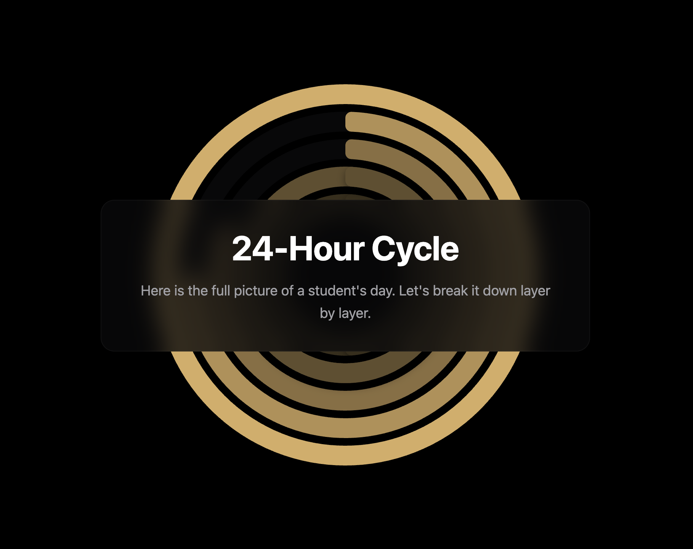
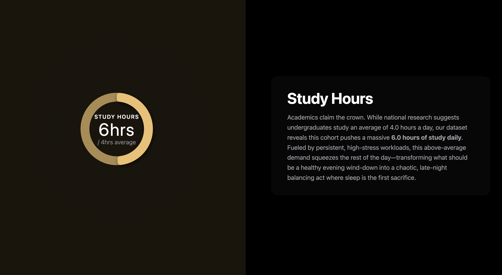
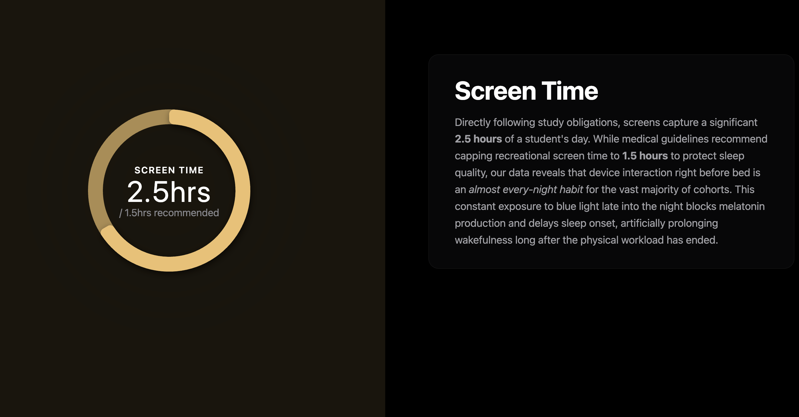
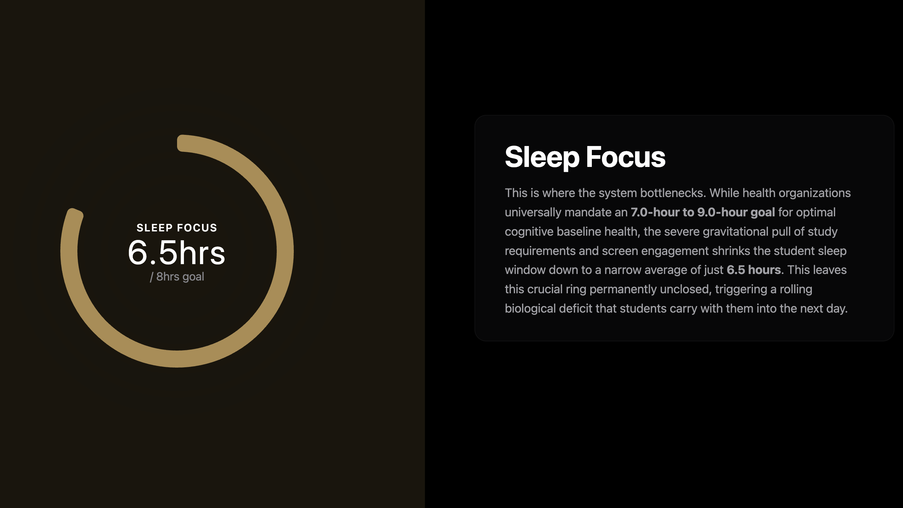
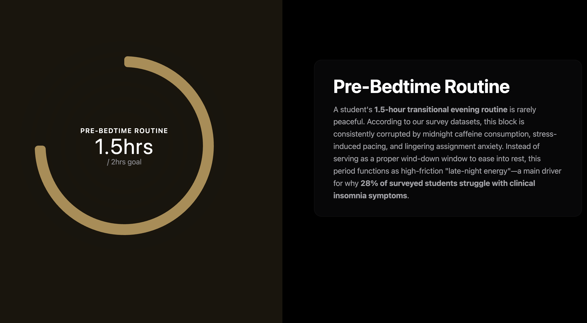
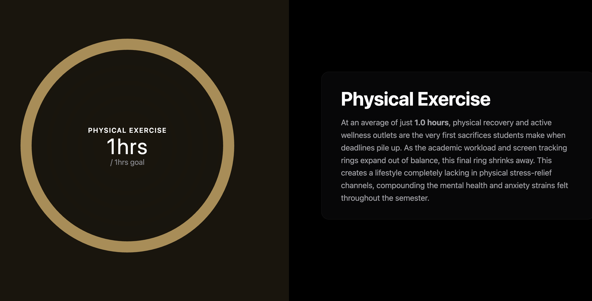

# Sleep Analytics Radial Visualization

## Overview
This branch (`radial-bar-chart`) contains a dynamic, interactive "scrollytelling" data visualization that explores the underlying causes of university student sleep deprivation. 

It utilizes **D3.js** and native **Intersection Observers** to map the user's scroll position to animated radial rings, drawing direct structural and aesthetic inspiration from the "Apple Fitness" ring UI. 

## Features
*   **Data-Driven Scrollytelling**: Ring progress and text metrics dynamically pull straight from our processed datasets (`student_sleep_patterns.csv` and `Student Insomnia and Educational Outcomes.csv`).
*   **Apple-Watch-Rings Inspriration**: Rings that exceed 100% of their recommended baseline (such as Study Hours and Screen Time) visually overlap themselves. A distinct drop shadow is applied to the overflow arc to clearly emphasize over-exertion, identical to Apple Watch rings.
*   **Split-Screen Layout Shift**: As users scroll past the introduction, the visualization smoothly shifts from a centered layout to a sticky split-screen view. The animated rings remain locked on the left half of the screen while narrative text blocks scroll into view on the right.
*   **Dynamic Visuals**: The ring color standardizes to a unified highlight color (`#D6AC62`) when isolated, and the left-hand background automatically updates with a subtle, frosted glass tint to match. The massive central ring text also instantly recalculates to show the exact metrics of the focused ring.

## Core Files & Technical Structure
*   **`radial_chart.html`**: The main entry point. Contains the HTML structure, the D3.js rendering engine, SVG path generators (both base arcs and overflow arcs), and the Javascript scroll observer logic.
*   **`styles.css`**: Controls the layout transitions (`.centered-step` vs `.split-step`), the sticky canvas positioning (`.split-mode`), and the translucent Apple-inspired UI elements.
*   **`dataset/preprocess.py`**: A python script that computes the core metrics, defines the goal/baseline markers, and builds the JSON payload.
*   **`student_activity_rings.json`**: The final compiled dataset that the frontend visualization fetches to render the rings and story text.

## How to Run Locally
Because this visualization fetches an external `.json` file via Javascript, you cannot simply double-click the HTML file (you will hit a CORS error). You must run a local web server:

1. Open your terminal in the root directory of this repository.
2. Run the following command:
   ```bash
   python -m http.server 8080
   ```
3. Open your web browser and navigate to: `http://localhost:8080/radial_chart.html`

## Visual Previews

### 1. The Deficit (Intro / All Rings)


### 2. Isolated View: Study Hours (Showing the Apple Overflow effect)


### 3. Isolated View: Screen Time 


### 4. Isolated View: Sleep Focus


### 5. Isolated View: Pre-Bedtime Routine


### 6. Isolated View: Physical Exercise

